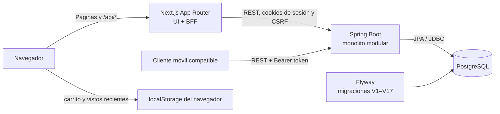

# Contexto del proyecto NEXO Commerce

Guía de referencia para entender qué hace el sistema, cómo evolucionó y cómo se conectan sus partes. Describe el estado del código de `develop` al 7 de octubre de 2026; en esa fecha, `master` tenía el mismo árbol de archivos. Para las reglas de trabajo y ramas, consulta [CONTRIBUTING.md](../CONTRIBUTING.md).

## Resumen

NEXO Commerce es una tienda web de demostración con un panel administrativo. El frontend está construido con Next.js, React y TypeScript. La API está implementada como un monolito modular Spring Boot; PostgreSQL es la fuente de verdad para las cuentas y los datos del negocio, y Flyway versiona los cambios de esquema.

El producto evolucionó desde una interfaz frontend organizada por dominios hacia una aplicación conectada a Spring y PostgreSQL. Next.js se mantiene como interfaz y BFF (backend for frontend): el navegador llama al mismo origen y las rutas servidoras `/api/...` de Next.js reenvían las solicitudes a Spring. El backend concentra persistencia, autenticación y autorización.

## Arquitectura



### Frontend y BFF

- `src/app` contiene rutas, layouts y grupos de páginas públicas, de autenticación y administrativas.
- `src/app/api/[...path]/route.ts` reenvía al backend las solicitudes `/api/...`; mantiene las llamadas del navegador en el mismo origen y reenvía los datos de sesión y CSRF.
- `src/modules` agrupa pantallas y lógica por áreas: autenticación, comercio, productos, ventas, compras, proveedores, marcas, contabilidad y roles.
- `src/contexts`, `src/data`, `src/services` y `src/types.ts` aún contienen estado, contratos y servicios compartidos en transición hacia una separación completa por dominio. Revisa el módulo y servicio actuales antes de agregar otra implementación.
- El carrito y los productos vistos recientemente son preferencias locales del navegador. No se sincronizan entre dispositivos.

### Backend

El código de Spring está en `backend/src/main/java/gt/nexo/commerce` y se divide principalmente en:

- `identity`: registro, login, sesiones, usuarios, roles, permisos, invitaciones y autenticación móvil.
- `business`: catálogo, imágenes, inventario, compras, ventas, pedidos, promociones, descuentos, comprobantes y notificaciones de clientes.
- `shared`: seguridad, configuración y manejo común de errores.

Los controladores exponen la API; los servicios de aplicación aplican reglas del negocio; las entidades y repositorios guardan los datos en PostgreSQL. Hibernate valida el esquema y Flyway aplica las migraciones; no se usa Hibernate para crear o alterar el esquema automáticamente.

### Datos y migraciones

- PostgreSQL es la fuente compartida para usuarios, roles, catálogo, inventario, pedidos, ventas y demás registros del negocio.
- Las migraciones viven en `backend/src/main/resources/db/migration`. El repositorio contiene las versiones V1 a V17; el backend ejecuta las pendientes al arrancar.
- Las imágenes de producto pueden almacenarse en PostgreSQL; el servicio limita las imágenes cargadas como datos embebidos a 140 KB.
- El equipo puede usar una base PostgreSQL compartida en Neon con el perfil Spring `team`. La configuración privada va en `backend/.env.team`, excluido por Git. Este documento no incluye la URL del servidor ni credenciales.
- `backend/README.md` explica la inicialización local y compartida, los perfiles y las variables requeridas. Coordina los arranques contra la base compartida: iniciar Spring puede aplicar migraciones pendientes.

## Funcionalidad actual

### Tienda y cuenta de cliente

- Catálogo persistido con búsqueda, categorías y ordenamiento; detalle de producto, ofertas y anuncios.
- Carrito local, validación de descuentos, checkout y confirmación de pedido.
- Registro e inicio de sesión de clientes, historial de pedidos propios, lista de deseos y notificaciones.

### Panel administrativo y operación

- Dashboard, productos, marcas, categorías, inventario, compras, ventas, clientes y proveedores.
- Administración de roles y permisos; Spring valida los permisos al ejecutar operaciones protegidas.
- Promociones, anuncios y códigos de descuento administrados desde el panel.
- Punto de venta presencial con efectivo o tarjeta simulada, artículos, cliente, monto recibido y cambio.
- Ingresos y egresos en el módulo de contabilidad.
- Reportes fue retirado de la interfaz y del backend; la migración V16 elimina permisos y registros relacionados.

### Límites de producto

- Tarjeta y transferencia son flujos de demostración; no se procesa ningún cobro real. Los comprobantes de transferencia se guardan para revisión del personal autorizado.
- La base local nueva puede iniciar vacía. El README del backend documenta una carga opcional del catálogo de demostración.
- La API incluye autenticación móvil con tokens Bearer, separados de las sesiones web; este repositorio documenta la API, pero el frontend descrito aquí es Next.js.

## Seguridad y sesiones

- Spring es la autoridad para identidad, sesión y permisos administrativos.
- La sesión web se persiste con Spring Session JDBC. La cookie se configura como `HttpOnly` y `SameSite=Lax`; `Secure` depende del perfil y el entorno.
- Las escrituras web requieren token CSRF. El BFF de Next.js reenvía el token y la cookie a Spring.
- Las rutas móviles usan tokens Bearer opacos; el backend conserva el hash del token y carga los permisos vigentes al autenticar la solicitud.
- En producción, usa HTTPS entre navegador, Next.js y Spring; mantén el backend en una red privada y OpenAPI desactivado salvo que se necesite expresamente.
- No guardes contraseñas, tokens, URL con credenciales ni archivos `.env` en Git. Los archivos `.env.*` están ignorados.

## Ejecución

### Stack local con Docker Compose

Desde la raíz, configura `backend/.env` y ejecuta:

```powershell
docker compose up --build -d
docker compose ps
```

Esto levanta PostgreSQL local, Spring y Next.js. La web se publica en `http://localhost:13000`, Swagger en `http://localhost:18080/swagger-ui.html` y PostgreSQL en `127.0.0.1:15432`. Los puertos se enlazan a loopback; el volumen `nexo-commerce-dev-data` conserva los datos al bajar los servicios.

### Base compartida del equipo

Configura `backend/.env.team` por el canal privado del equipo y, desde la raíz, ejecuta:

```powershell
docker compose -f compose.team.yaml up --build -d
docker compose -f compose.team.yaml ps
```

Este Compose levanta Next.js y Spring contra la base compartida, sin iniciar PostgreSQL local. La web y Swagger se publican en los mismos puertos locales de arriba. `docker compose -f compose.team.yaml down` detiene esos servicios.

### Desarrollo por separado

`npm run dev` inicia únicamente Next.js en `http://localhost:3000`; no levanta Spring ni PostgreSQL. Para la API, consulta las instrucciones de `backend/README.md` para arrancar PostgreSQL y ejecutar `mvn spring-boot:run` con el perfil adecuado.

## Construcción y herramientas

- Frontend: Next.js 16, React 19 y TypeScript. `npm run build` genera la compilación de producción.
- Backend: Java 21, Spring Boot 4, Maven y PostgreSQL. `mvn package` compila y ejecuta las pruebas Maven configuradas.
- Contenedores: Dockerfiles separados para Next.js y Spring; Compose define las variantes local y de equipo.
- La documentación operativa completa está en [README.md](../README.md) y [backend/README.md](../backend/README.md). El flujo de integración está en [CONTRIBUTING.md](../CONTRIBUTING.md).

## Evolución técnica resumida

1. Se organizó la experiencia de tienda y panel en Next.js con módulos por dominio.
2. Se incorporó Spring Boot como API para identidad y operaciones del negocio, con PostgreSQL y Flyway.
3. Next.js adoptó el papel de BFF para mantener las llamadas del navegador en el mismo origen y reenviar sesiones y CSRF.
4. El dominio persistido se amplió a pedidos de clientes, wishlist y notificaciones; ventas presenciales y contabilidad se conectaron a los registros del backend.
5. Se prepararon perfiles y Compose para desarrollo local y para el uso coordinado de una base compartida por el equipo.

Para cambios nuevos, sigue `CONTRIBUTING.md`: crea una rama personal desde `origin/develop`, limita cada cambio a su alcance, compila y solicita revisión antes de integrar.
